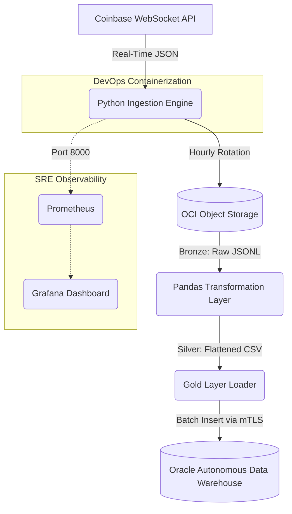

# 📈 Real-Time Cryptocurrency Data Pipeline & SRE Observability Stack


## 📌 Project Overview
An enterprise-grade, end-to-end Data Engineering and DevOps pipeline that ingests high-velocity live market data from the Coinbase WebSocket API. The system enforces strict Medallion Architecture principles (Bronze, Silver, Gold layers), operates fully autonomously via Docker and Cron, and provides real-time system monitoring using an industry-standard Prometheus and Grafana stack.

**Business Value:** Demonstrates the ability to handle continuous streaming data without loss, securely transform unstructured nested payloads, and maintain zero-downtime infrastructure.

---

## 📊 Live System Proof

Here is the pipeline running successfully in production, maintaining a zero-downtime streaming state and broadcasting live infrastructure telemetry:

### 1. Real-Time Grafana Telemetry Dashboard
*This live line-graph visualizes real-time market volatility and transaction ingestion throughput directly from the Coinbase WebSocket engine:*


### 2. Containerized Microservice Topology (`docker ps`)
*The entire pipeline running in isolated, self-healing Docker containers on an Oracle Cloud compute instance:*


---

## 🏗️ Architecture & Data Flow



### 1. The Bronze Layer (Raw Ingestion)

* **Asynchronous Streaming:** Utilizes Python's `asyncio` and `websockets` to maintain a persistent, non-blocking connection to Coinbase's Advanced Trade API.
* **Smart File Rotation:** Dynamically batches streaming data into JSONL files, rotating them automatically at the top of every hour.
* **Secure Cloud Sync:** Leverages **IAM Instance Principals** to securely authenticate and sync historical files to an Oracle Cloud Infrastructure (OCI) Object Storage bucket (zero hardcoded API keys).

### 2. The Silver Layer (Transformation)

* **Data Flattening:** Uses `pandas` to parse deeply nested JSON event arrays into flat, relational structures.
* **Type Enforcement & Feature Engineering:** Casts string-based network payloads into strict numerical types and derives new business metrics (e.g., Total 24-Hour USD Volume).

### 3. The Gold Layer (Analytics-Ready)

* **High-Speed Loading:** Utilizes `oracledb.executemany()` to perform rapid batch insertions of transformed data.
* **Enterprise Security:** Connects to an Oracle Serverless Lakehouse using strict **Mutual TLS (mTLS)** cryptographic wallet authentication.

---

## ⚙️ DevOps & Site Reliability Engineering (SRE)

This pipeline is built for resilience, fault tolerance, and complete observability.

* **Containerization:** The ingestion engine is packaged in a lightweight `python:3.9-slim` Docker container.
* **Declarative Infrastructure:** Managed via `docker-compose.yml` with strict `restart: unless-stopped` policies for self-healing application recovery.
* **Batch Automation:** Silver and Gold transformations are sequentially orchestrated via a unified Bash script scheduled by a Linux `crontab` engine.
* **Real-Time Telemetry:** The Python engine is instrumented with the `prometheus_client` to broadcast live metrics (Trade Throughput, BTC Price Volatility).
* **Visualization:** Grafana queries Prometheus every 5 seconds to power a live, web-accessible system dashboard.

---

## 📂 Repository Structure

```text
├── src/
│   ├── ingest.py           # Bronze layer: Async WebSocket consumer & OCI uploader
│   ├── transform.py        # Silver layer: Pandas JSON flattener & cleaner
│   ├── load.py             # Gold layer: mTLS Oracle DB batch loader
│   └── run_pipeline.sh     # Automation engine for CRON execution
├── config/
│   ├── prometheus.yml      # Scrape configurations for metrics
│   └── .gitignore          # Security blocks for Cryptographic Wallets
├── Dockerfile              # Blueprint for the Ingestion Microservice
├── docker-compose.yml      # Declarative infrastructure for App, Prometheus, & Grafana
└── requirements.txt        # Pinned Python dependencies

```

---

## 🚀 Quick Start Guide

**1. Clone the repository:**

```bash
git clone git@github.com:YourUsername/coinbase-data-pipeline.git
cd coinbase-data-pipeline

```

**2. Supply your cryptographic database wallet:**
Place your downloaded `Wallet_YourDB.zip` from Oracle Cloud into the root directory and extract it into a `/wallet` folder. *(Note: The `.gitignore` will safely prevent this from being pushed to version control).*

**3. Launch the streaming pipeline & observability stack:**

```bash
docker compose up -d --build

```

**4. Access the Grafana Dashboard:**
Navigate to `http://localhost:3005` in your browser (Default login: `admin` / `admin`). Configure Prometheus as a data source pointing to `http://prometheus:9090`.

---

*Built to demonstrate scalable Data Engineering, Cloud Infrastructure, and SRE best practices.*
EOF
